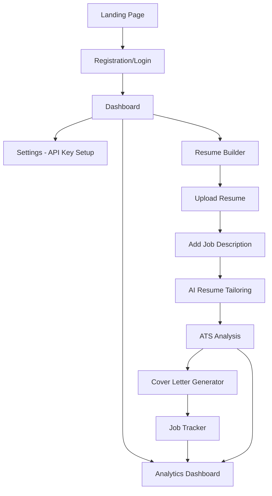

# CareerSync - Product Requirements Document

## 1. Product Overview

CareerSync is an AI-powered resume and career optimization SaaS tool that helps job seekers align their resumes with specific job opportunities using advanced AI analysis and tailoring capabilities.

The platform solves the critical problem of resume-job description misalignment by providing automated ATS scoring, intelligent resume tailoring, and comprehensive career optimization tools. Target users include job seekers, career changers, and professionals looking to optimize their application success rate. CareerSync aims to become the go-to platform for AI-driven career optimization, operating entirely on free-tier infrastructure to ensure zero operational costs.

## 2. Core Features

### 2.1 User Roles

| Role | Registration Method | Core Permissions |
|------|---------------------|------------------|
| Registered User | Email registration or Google OAuth | Full access to all features including resume upload, AI analysis, job tracking, and analytics |
| Guest User | No registration required | Limited access to view landing page and feature demonstrations |

### 2.2 Feature Module

Our CareerSync platform consists of the following main pages:

1. **Landing Page**: hero section with value proposition, feature highlights, pricing information, and call-to-action buttons.
2. **Authentication Pages**: login and registration forms with email and Google OAuth options.
3. **Dashboard**: main navigation hub with tabs for Builder, ATS & Improvement, Cover Letter, Tracker, Analytics, and Settings.
4. **Resume Builder**: upload interface, side-by-side editor for original vs tailored resume comparison, and AI-powered optimization tools.
5. **ATS Analysis Page**: keyword extraction, ATS scoring (0-100), missing skills identification, and improvement suggestions.
6. **Cover Letter Generator**: AI-powered cover letter creation with tone selection and job-specific customization.
7. **Job Tracker**: comprehensive application management with status tracking and analytics.
8. **Analytics Dashboard**: performance metrics, ATS score trends, and improvement tracking.
9. **Settings Page**: user profile management, Gemini API key configuration, and account preferences.

### 2.3 Page Details

| Page Name | Module Name | Feature description |
|-----------|-------------|---------------------|
| Landing Page | Hero Section | Display primary tagline "Align your career with every opportunity", feature overview, and sign-up call-to-action |
| Landing Page | Feature Showcase | Highlight key features: Resume Tailor, ATS Analysis, Cover Letter Generator, Job Tracker |
| Landing Page | Pricing Section | Emphasize zero-cost model with user-provided API keys |
| Authentication | Login Form | Email/password authentication with Google OAuth integration |
| Authentication | Registration Form | User account creation with email verification |
| Dashboard | Navigation Tabs | Access to Builder, ATS & Improvement, Cover Letter, Tracker, Analytics, Settings |
| Dashboard | Quick Stats | Display recent ATS scores, application count, and improvement metrics |
| Resume Builder | File Upload | Support PDF/DOCX upload and LinkedIn import functionality |
| Resume Builder | Job Description Input | Paste or import job descriptions from LinkedIn/Indeed |
| Resume Builder | Side-by-Side Editor | Compare original resume with AI-tailored version in split view |
| Resume Builder | AI Optimization | Generate tailored resume content matching job requirements |
| ATS Analysis | Keyword Extraction | Identify and highlight relevant keywords from job descriptions |
| ATS Analysis | ATS Scoring | Calculate and display ATS compatibility score (0-100) |
| ATS Analysis | Gap Analysis | Show missing skills, keyword density, and formatting issues |
| ATS Analysis | Improvement Suggestions | Provide actionable recommendations with one-click apply functionality |
| ATS Analysis | Achievement Quantifier | Enhance bullet points with metrics and action verbs |
| Cover Letter Generator | AI Letter Creation | Generate job-specific cover letters using resume and job description |
| Cover Letter Generator | Tone Selection | Choose from Formal, Friendly, or Confident writing styles |
| Cover Letter Generator | Editable Output | Allow users to modify generated content before saving |
| Job Tracker | Application Table | Track Company, Role, Resume, ATS Score, Status, and Date |
| Job Tracker | Status Management | Update application status: Applied, Interviewing, Offer, Rejected |
| Job Tracker | Notes & Reminders | Add personal notes and set follow-up reminders |
| Analytics Dashboard | Performance Metrics | Display average ATS scores, total applications, and success rates |
| Analytics Dashboard | Trend Charts | Visualize ATS score improvements and application patterns over time |
| Analytics Dashboard | Skill Gap Analysis | Identify missing skills and recommend relevant courses |
| Settings | Profile Management | Update user information and preferences |
| Settings | API Key Configuration | Securely store and manage Gemini API key with encryption |
| Settings | Account Settings | Manage notifications, privacy settings, and data export options |

## 3. Core Process

**Main User Flow:**
Users begin by registering and setting up their Gemini API key in Settings. They upload their base resume and paste a target job description in the Resume Builder. The AI analyzes both documents and generates a tailored resume optimized for the specific role. Users can then run ATS analysis to receive a compatibility score and improvement suggestions. They can generate a matching cover letter and track their application in the Job Tracker. The Analytics dashboard provides insights into their optimization progress and success patterns.

**Guest User Flow:**
Visitors can explore the landing page, view feature demonstrations, and access limited functionality before deciding to register for full access.

## 4. User Interface Design

### 4.1 Design Style

- **Primary Color**: #4C82FB (Professional Blue)
- **Secondary Colors**: #F8FAFC (Light Gray), #1E293B (Dark Gray), #10B981 (Success Green), #EF4444 (Error Red)
- **Button Style**: Rounded corners (8px radius), subtle shadows, hover animations
- **Typography**: Inter font family, 16px base size, clear hierarchy with 14px-32px range
- **Layout Style**: Clean card-based design with generous white space, sidebar navigation, minimal borders
- **Icons**: Lucide React icons for consistency, 20px standard size
- **Animations**: Subtle transitions (200ms), loading states, micro-interactions

### 4.2 Page Design Overview

| Page Name | Module Name | UI Elements |
|-----------|-------------|-------------|
| Landing Page | Hero Section | Large heading with gradient text, animated background, prominent CTA button with #4C82FB background |
| Landing Page | Feature Cards | Grid layout with icons, white cards with subtle shadows, hover effects |
| Dashboard | Navigation Sidebar | Fixed left sidebar with tab icons, active state highlighting, clean typography |
| Dashboard | Main Content | Card-based layout with metrics, charts using Recharts library, responsive grid |
| Resume Builder | Split Editor | Two-column layout, syntax highlighting for text, diff visualization for changes |
| Resume Builder | Upload Area | Drag-and-drop zone with dotted border, file type indicators, progress bars |
| ATS Analysis | Score Display | Large circular progress indicator, color-coded scoring (red/yellow/green) |
| ATS Analysis | Keyword Highlights | Tag-based display with color coding, missing keywords in red |
| Cover Letter Generator | Tone Selector | Radio button group with custom styling, preview cards for each tone |
| Job Tracker | Data Table | Sortable columns, status badges with color coding, action buttons |
| Analytics Dashboard | Charts | Line charts for trends, bar charts for comparisons, donut charts for distributions |
| Settings | Form Layout | Clean form design with proper spacing, toggle switches, secure input fields |

### 4.3 Responsiveness

The application follows a desktop-first approach with mobile-adaptive design. Key responsive features include:
- Collapsible sidebar navigation on mobile devices
- Stacked layout for split-screen components on tablets
- Touch-optimized buttons and form elements
- Responsive typography scaling
- Mobile-friendly file upload with camera integration
- Swipe gestures for navigation on mobile devices