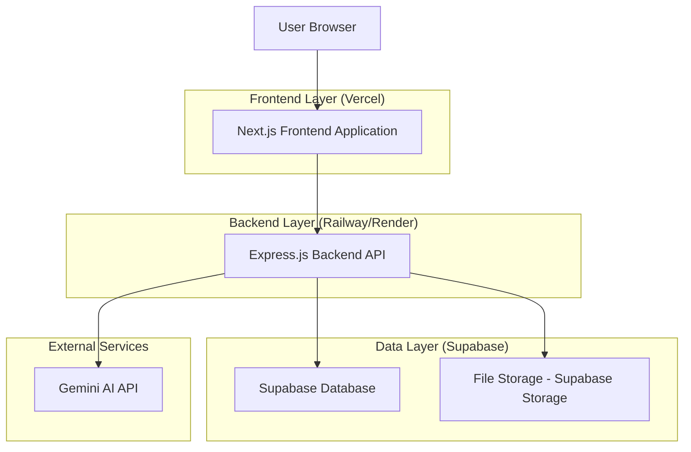
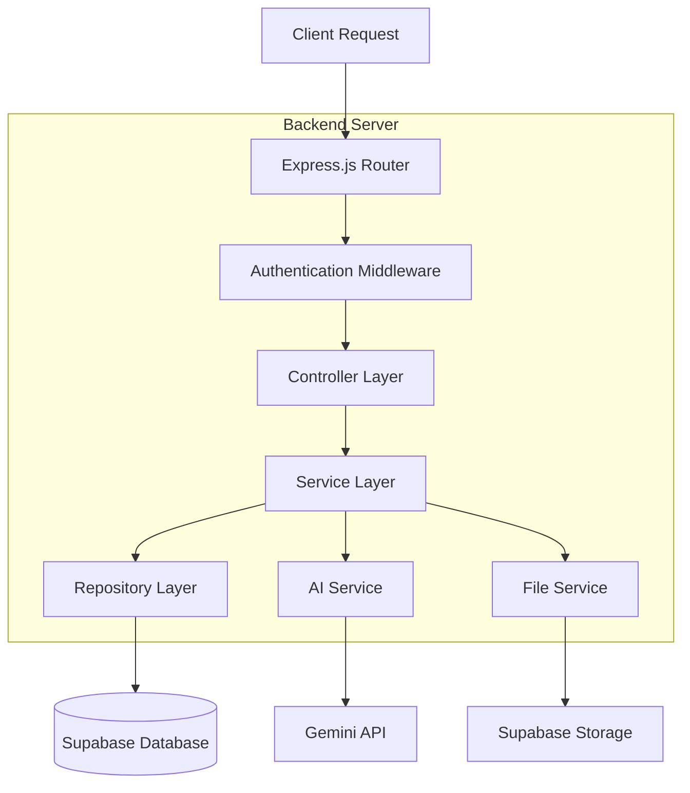
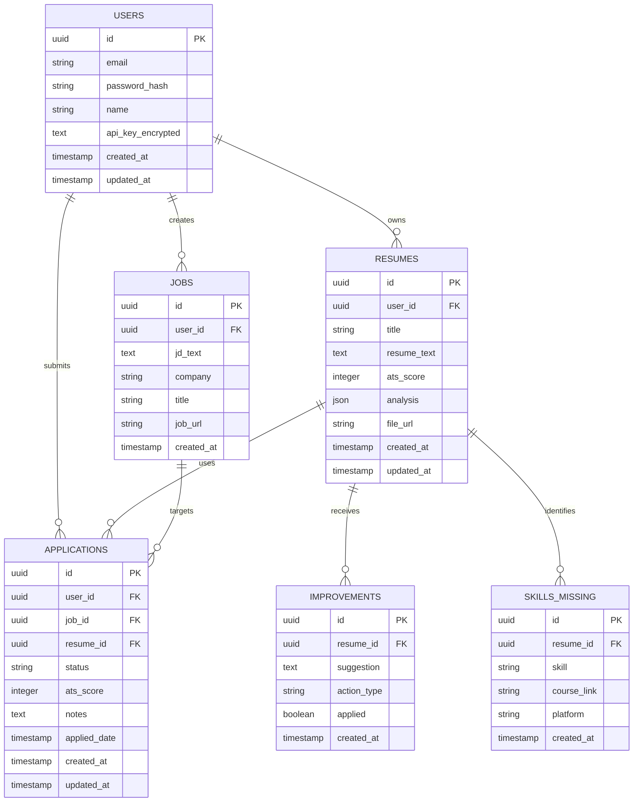

# CareerSync - Technical Architecture Document

## 1. Architecture Design



## 2. Technology Description

* **Frontend**: Next.js\@14 + TypeScript + Tailwind CSS\@3 + Recharts + Lucide React

* **Backend**: Express.js\@4 + TypeScript + bcrypt + jsonwebtoken

* **Database**: Supabase (PostgreSQL)

* **Authentication**: Supabase Auth (Email + Google OAuth)

* **File Storage**: Supabase Storage

* **AI Integration**: Google Gemini API (user-provided keys)

* **Deployment**: Vercel (Frontend) + Railway/Render (Backend)

## 3. Route Definitions

| Route          | Purpose                                              |
| -------------- | ---------------------------------------------------- |
| /              | Landing page with hero section and feature overview  |
| /auth/login    | User authentication page with email and Google OAuth |
| /auth/register | User registration page with email verification       |
| /dashboard     | Main dashboard with navigation tabs and quick stats  |
| /builder       | Resume builder with upload and AI tailoring features |
| /ats-analysis  | ATS scoring and improvement suggestions              |
| /cover-letter  | AI-powered cover letter generator                    |
| /tracker       | Job application tracking and management              |
| /analytics     | Performance metrics and trend analysis               |
| /settings      | User profile and API key management                  |

## 4. API Definitions

### 4.1 Core API

**Authentication**

```
POST /api/auth/register
```

Request:

| Param Name | Param Type | isRequired | Description                      |
| ---------- | ---------- | ---------- | -------------------------------- |
| email      | string     | true       | User email address               |
| password   | string     | true       | User password (min 8 characters) |
| name       | string     | true       | User full name                   |

Response:

| Param Name | Param Type | Description              |
| ---------- | ---------- | ------------------------ |
| success    | boolean    | Registration status      |
| user       | object     | User profile data        |
| token      | string     | JWT authentication token |

**Resume Management**

```
POST /api/resumes/upload
```

Request:

| Param Name | Param Type | isRequired | Description            |
| ---------- | ---------- | ---------- | ---------------------- |
| file       | File       | true       | Resume file (PDF/DOCX) |
| title      | string     | true       | Resume title/name      |

Response:

| Param Name      | Param Type | Description              |
| --------------- | ---------- | ------------------------ |
| success         | boolean    | Upload status            |
| resume\_id      | string     | Unique resume identifier |
| extracted\_text | string     | Parsed resume content    |

**AI Analysis**

```
POST /api/ai/tailor-resume
```

Request:

| Param Name       | Param Type | isRequired | Description              |
| ---------------- | ---------- | ---------- | ------------------------ |
| resume\_id       | string     | true       | Resume identifier        |
| job\_description | string     | true       | Target job description   |
| user\_api\_key   | string     | true       | Encrypted Gemini API key |

Response:

| Param Name       | Param Type | Description                     |
| ---------------- | ---------- | ------------------------------- |
| success          | boolean    | Analysis status                 |
| tailored\_resume | string     | AI-optimized resume content     |
| ats\_score       | number     | ATS compatibility score (0-100) |
| improvements     | array      | List of suggested improvements  |

**Job Tracking**

```
POST /api/applications
```

Request:

| Param Name       | Param Type | isRequired | Description          |
| ---------------- | ---------- | ---------- | -------------------- |
| company          | string     | true       | Company name         |
| role             | string     | true       | Job title/role       |
| resume\_id       | string     | true       | Associated resume    |
| job\_description | string     | false      | Job description text |
| status           | string     | true       | Application status   |

Response:

| Param Name      | Param Type | Description                   |
| --------------- | ---------- | ----------------------------- |
| success         | boolean    | Creation status               |
| application\_id | string     | Unique application identifier |

## 5. Server Architecture Diagram



## 6. Data Model

### 6.1 Data Model Definition



### 6.2 Data Definition Language

**Users Table**

```sql
-- Create users table
CREATE TABLE users (
    id UUID PRIMARY KEY DEFAULT gen_random_uuid(),
    email VARCHAR(255) UNIQUE NOT NULL,
    password_hash VARCHAR(255) NOT NULL,
    name VARCHAR(100) NOT NULL,
    api_key_encrypted TEXT,
    created_at TIMESTAMP WITH TIME ZONE DEFAULT NOW(),
    updated_at TIMESTAMP WITH TIME ZONE DEFAULT NOW()
);

-- Create indexes
CREATE INDEX idx_users_email ON users(email);
CREATE INDEX idx_users_created_at ON users(created_at DESC);

-- Set up RLS policies
ALTER TABLE users ENABLE ROW LEVEL SECURITY;
CREATE POLICY "Users can view own profile" ON users FOR SELECT USING (auth.uid() = id);
CREATE POLICY "Users can update own profile" ON users FOR UPDATE USING (auth.uid() = id);

-- Grant permissions
GRANT SELECT ON users TO anon;
GRANT ALL PRIVILEGES ON users TO authenticated;
```

**Resumes Table**

```sql
-- Create resumes table
CREATE TABLE resumes (
    id UUID PRIMARY KEY DEFAULT gen_random_uuid(),
    user_id UUID REFERENCES users(id) ON DELETE CASCADE,
    title VARCHAR(200) NOT NULL,
    resume_text TEXT NOT NULL,
    ats_score INTEGER DEFAULT 0 CHECK (ats_score >= 0 AND ats_score <= 100),
    analysis JSONB,
    file_url TEXT,
    created_at TIMESTAMP WITH TIME ZONE DEFAULT NOW(),
    updated_at TIMESTAMP WITH TIME ZONE DEFAULT NOW()
);

-- Create indexes
CREATE INDEX idx_resumes_user_id ON resumes(user_id);
CREATE INDEX idx_resumes_ats_score ON resumes(ats_score DESC);
CREATE INDEX idx_resumes_created_at ON resumes(created_at DESC);

-- Set up RLS policies
ALTER TABLE resumes ENABLE ROW LEVEL SECURITY;
CREATE POLICY "Users can manage own resumes" ON resumes FOR ALL USING (auth.uid() = user_id);

-- Grant permissions
GRANT SELECT ON resumes TO anon;
GRANT ALL PRIVILEGES ON resumes TO authenticated;
```

**Jobs Table**

```sql
-- Create jobs table
CREATE TABLE jobs (
    id UUID PRIMARY KEY DEFAULT gen_random_uuid(),
    user_id UUID REFERENCES users(id) ON DELETE CASCADE,
    jd_text TEXT NOT NULL,
    company VARCHAR(200) NOT NULL,
    title VARCHAR(200) NOT NULL,
    job_url TEXT,
    created_at TIMESTAMP WITH TIME ZONE DEFAULT NOW()
);

-- Create indexes
CREATE INDEX idx_jobs_user_id ON jobs(user_id);
CREATE INDEX idx_jobs_company ON jobs(company);
CREATE INDEX idx_jobs_created_at ON jobs(created_at DESC);

-- Set up RLS policies
ALTER TABLE jobs ENABLE ROW LEVEL SECURITY;
CREATE POLICY "Users can manage own jobs" ON jobs FOR ALL USING (auth.uid() = user_id);

-- Grant permissions
GRANT SELECT ON jobs TO anon;
GRANT ALL PRIVILEGES ON jobs TO authenticated;
```

**Applications Table**

```sql
-- Create applications table
CREATE TABLE applications (
    id UUID PRIMARY KEY DEFAULT gen_random_uuid(),
    user_id UUID REFERENCES users(id) ON DELETE CASCADE,
    job_id UUID REFERENCES jobs(id) ON DELETE CASCADE,
    resume_id UUID REFERENCES resumes(id) ON DELETE CASCADE,
    status VARCHAR(50) DEFAULT 'applied' CHECK (status IN ('applied', 'interviewing', 'offer', 'rejected')),
    ats_score INTEGER DEFAULT 0 CHECK (ats_score >= 0 AND ats_score <= 100),
    notes TEXT,
    applied_date DATE DEFAULT CURRENT_DATE,
    created_at TIMESTAMP WITH TIME ZONE DEFAULT NOW(),
    updated_at TIMESTAMP WITH TIME ZONE DEFAULT NOW()
);

-- Create indexes
CREATE INDEX idx_applications_user_id ON applications(user_id);
CREATE INDEX idx_applications_status ON applications(status);
CREATE INDEX idx_applications_applied_date ON applications(applied_date DESC);
CREATE INDEX idx_applications_ats_score ON applications(ats_score DESC);

-- Set up RLS policies
ALTER TABLE applications ENABLE ROW LEVEL SECURITY;
CREATE POLICY "Users can manage own applications" ON applications FOR ALL USING (auth.uid() = user_id);

-- Grant permissions
GRANT SELECT ON applications TO anon;
GRANT ALL PRIVILEGES ON applications TO authenticated;
```

**Improvements Table**

```sql
-- Create improvements table
CREATE TABLE improvements (
    id UUID PRIMARY KEY DEFAULT gen_random_uuid(),
    resume_id UUID REFERENCES resumes(id) ON DELETE CASCADE,
    suggestion TEXT NOT NULL,
    action_type VARCHAR(100) NOT NULL,
    applied BOOLEAN DEFAULT FALSE,
    created_at TIMESTAMP WITH TIME ZONE DEFAULT NOW()
);

-- Create indexes
CREATE INDEX idx_improvements_resume_id ON improvements(resume_id);
CREATE INDEX idx_improvements_applied ON improvements(applied);
CREATE INDEX idx_improvements_created_at ON improvements(created_at DESC);

-- Set up RLS policies
ALTER TABLE improvements ENABLE ROW LEVEL SECURITY;
CREATE POLICY "Users can view improvements for own resumes" ON improvements FOR SELECT 
USING (EXISTS (SELECT 1 FROM resumes WHERE resumes.id = improvements.resume_id AND resumes.user_id = auth.uid()));

-- Grant permissions
GRANT SELECT ON improvements TO anon;
GRANT ALL PRIVILEGES ON improvements TO authenticated;
```

**Skills Missing Table**

```sql
-- Create skills_missing table
CREATE TABLE skills_missing (
    id UUID PRIMARY KEY DEFAULT gen_random_uuid(),
    resume_id UUID REFERENCES resumes(id) ON DELETE CASCADE,
    skill VARCHAR(200) NOT NULL,
    course_link TEXT,
    platform VARCHAR(100),
    created_at TIMESTAMP WITH TIME ZONE DEFAULT NOW()
);

-- Create indexes
CREATE INDEX idx_skills_missing_resume_id ON skills_missing(resume_id);
CREATE INDEX idx_skills_missing_skill ON skills_missing(skill);
CREATE INDEX idx_skills_missing_platform ON skills_missing(platform);

-- Set up RLS policies
ALTER TABLE skills_missing ENABLE ROW LEVEL SECURITY;
CREATE POLICY "Users can view missing skills for own resumes" ON skills_missing FOR SELECT 
USING (EXISTS (SELECT 1 FROM resumes WHERE resumes.id = skills_missing.resume_id AND resumes.user_id = auth.uid()));

-- Grant permissions
GRANT SELECT ON skills_missing TO anon;
GRANT ALL PRIVILEGES ON skills_missing TO authenticated;

-- Initial sample data
INSERT INTO skills_missing (resume_id, skill, course_link, platform) VALUES
('sample-resume-id', 'React.js', 'https://www.coursera.org/learn/react', 'Coursera'),
('sample-resume-id', 'Machine Learning', 'https://www.udemy.com/course/machinelearning/', 'Udemy'),
('sample-resume-id', 'Project Management', 'https://www.linkedin.com/learning/project-management-foundations', 'LinkedIn Learning');
```

